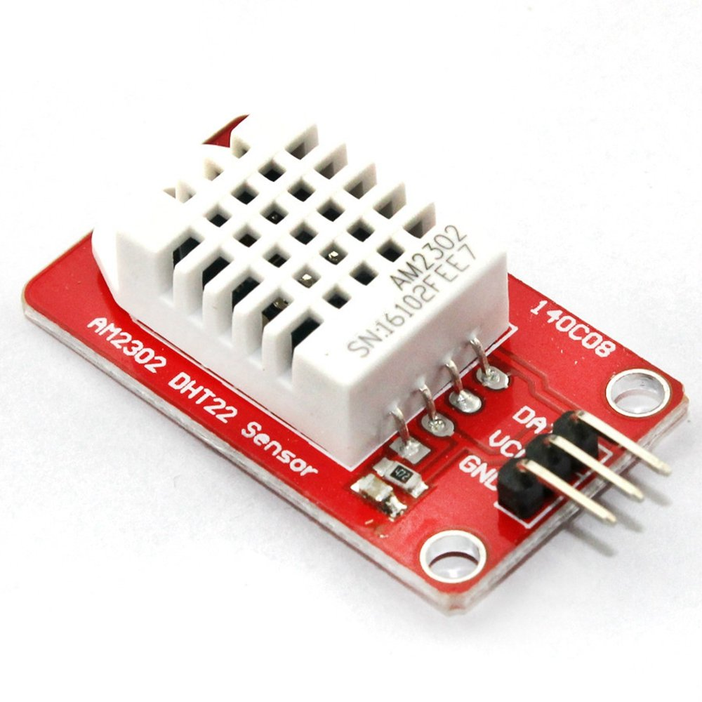

[](https://github.com/ItsGosho/DHT22/blob/main/LICENSE)

# DHT22:

Arduino Library for the DHT22 Temperature & Humidity sensor.



##### Example:

```c++
#include <Arduino.h>
#include <SerialPrintF.h>
#include "DHT22.h"

#define BAUD_RATE 9600
#define DHT22_PIN 10
#define MINIMAL_MEASUREMENT_DELAY_MS 2000

DHT22 dht22(DHT22_PIN);

void setup() {
    Serial.begin(BAUD_RATE);

    dht22.setDetectSignalTimeMs(10);
    dht22.setReadTimeoutUs(100);
    dht22.setResponseTimeoutUs(100);
}

void loop() {
    DHT22Measurement measurement = dht22.measure(MINIMAL_MEASUREMENT_DELAY_MS);

    serial_printf(Serial, "Humidity: %2f%%, Temperature %1f, Checksum: %s, Timed Out: %s\n",
                  measurement.humidity,
                  measurement.temperature,
                  measurement.isChecksumValid ? "true": "false",
                  measurement.isTimedOut ? "true" : "false");

}
```

You only need the two main files [`DHT22.cpp`](https://github.com/ItsGosho/DHT22/blob/main/src/DHT22.cpp) & [`DHT22.h`](https://github.com/ItsGosho/DHT22/blob/main/src/DHT22.h).

The [`StopWatchMicros.cpp`](https://github.com/ItsGosho/DHT22/blob/main/src/StopWatchMicros.cpp) & [`StopWatchMicros.h`](https://github.com/ItsGosho/DHT22/blob/main/src/StopWatchMicros.h) were used in the previous versions of the library and 
are left intentionally for future references to such logic.

The [`main.cpp`](https://github.com/ItsGosho/DHT22/blob/main/src/main.cpp) contains the same example used here in the [`README.md`](https://github.com/ItsGosho/DHT22/blob/main/README.md)

The [`serialPrintF`](https://github.com/ItsGosho/DHT22/tree/main/lib/serialPrintF) is used only in the example in [`main.cpp`](https://github.com/ItsGosho/DHT22/blob/main/src/main.cpp) it is not part of the two main files.

##### Features:

- Option to measure directly with delay without and with one directly specified in the measure
- Option to retrieve the easily information about the errors
- Directly getting the temperature in both Fahrenheit & Celsius
- Timeouts and the option to specify them
- Documentation on most of the methods

Initialization:

`DHT22 dht22(pin)` which will return you a class with operation onto the sensor

`measure()` which will return you a class containing the measurement values and a error ones

`measure(ms)` which will return a class containing the measurement values and a error ones, but also wait the
 given milliseconds before executing the measurement, which is ideal if you don't want to do it separately in the code

`setDetectSignalTimeMs(ms)` which is optional configuration for the wakeup delay

`setReadTimeoutUs(us)` which is optional configuration for the read timeout

`setResponseTimeoutUs(us)` which is optional configuration for the response timeout

##### Notes:

- When power is supplied to the sensor, don't send instruction to it for the first 1 second 
  to avoid unstable status
- The minimum time between measurements must be at least 2 seconds for the DHT22
- Place at least 4.7kOhm resistor between the DOUT & VCC Pin (Pull-up)
- Place 100nF capacitor between GND and VDD for wave filtering

##### Resources:
- [Used Sensor](https://www.waveshare.com/dht22-temperature-humidity-sensor.htm)
- [Data Sheet](https://cdn-shop.adafruit.com/datasheets/Digital+humidity+and+temperature+sensor+AM2302.pdf)
- [Checksum Problem](https://stackoverflow.com/questions/68547020/dht22-sensors-checksum-not-valid/68547021?noredirect=1#comment121145477_68547021)